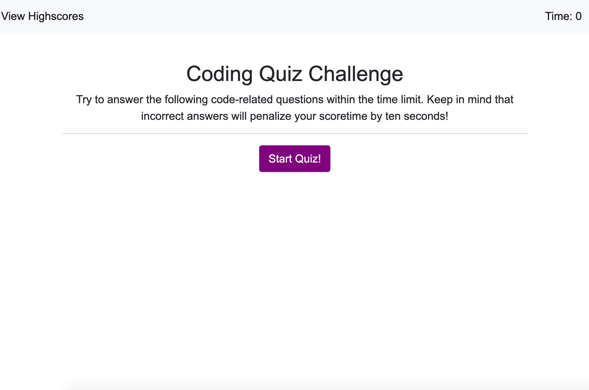
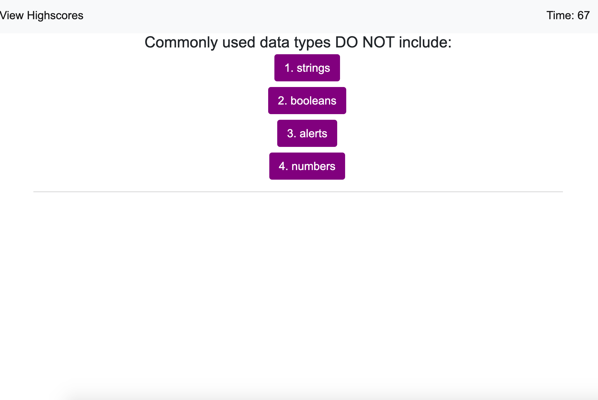
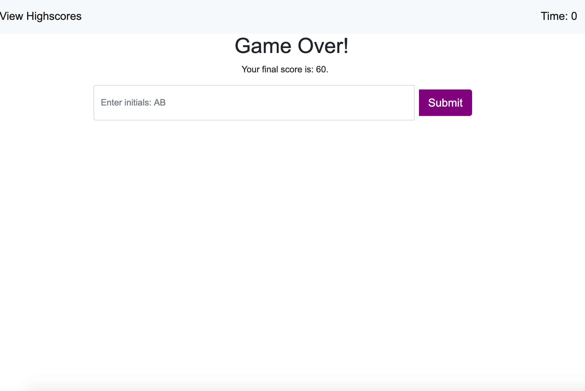
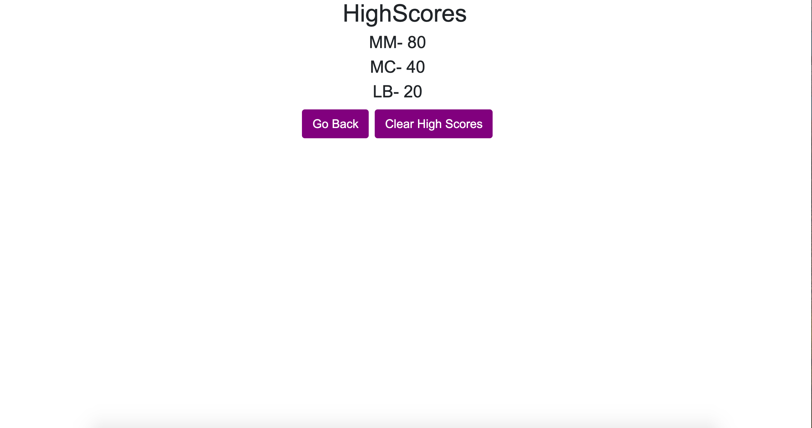
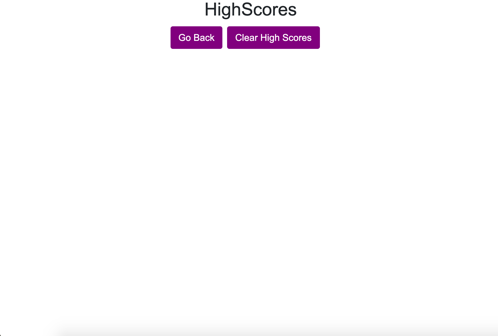

# Code Quiz

This web page generates a timed quiz to test the user's knowledge of JavaScript fundamentals. The interactive coding challenge is powered by JavaScript with dynamically updated HTML. The page is styled with Bootstrap as well as a minimal amount of CSS. The developer was asked to construct the following: 

* Timer function that starts when the first question is presented
* Tens seconds are subtracted from the clock if the user answers a questions incorrectly
* The quiz ends after five questions or if the timer hits zero
* When the game is over, ask users to save their initials and display it on a high scores page

# Installation
No installation is necessary. The code for this webpage can be found at [Github](https://github.com/mollymccollumwx/code-quiz). The [deployed website](https://mollymccollumwx.github.io/code-quiz/) features a simple code quiz with a clean, minimal design. 

# Usage
The user is greeted by a welcome message explaining the rules of the game. 

After pressing the start button, the user is shown the first question and the timer starts counting down from 75.

After five questions are answered or the timer reaches 0, the user is shown a "Game Over" message and their score. The user is asked to enter their initials. 

After submitting their initials, the user is sent to a page that lists the high scores. 

The user has the option to clear the list of high scores or go back to the beginning of the quiz. 

# Credits

This webpage was created while enrolled at the Georgia Tech Coding Bootcamp. Contributors include TAs and tutors who helped debug the code. Special shout-out to Pete Kriengsiri in the student study group who helped with the logic of the local storage for the high scores. 

# License 

MIT License

Copyright (c) [2020] [Molly M]

Permission is hereby granted, free of charge, to any person obtaining a copy of this software and associated documentation files (the "Software"), to deal in the Software without restriction, including without limitation the rights to use, copy, modify, merge, publish, distribute, sublicense, and/or sell copies of the Software, and to permit persons to whom the Software is furnished to do so, subject to the following conditions:

The above copyright notice and this permission notice shall be included in all copies or substantial portions of the Software.

THE SOFTWARE IS PROVIDED "AS IS", WITHOUT WARRANTY OF ANY KIND, EXPRESS OR IMPLIED, INCLUDING BUT NOT LIMITED TO THE WARRANTIES OF MERCHANTABILITY, FITNESS FOR A PARTICULAR PURPOSE AND NONINFRINGEMENT. IN NO EVENT SHALL THE AUTHORS OR COPYRIGHT HOLDERS BE LIABLE FOR ANY CLAIM, DAMAGES OR OTHER LIABILITY, WHETHER IN AN ACTION OF CONTRACT, TORT OR OTHERWISE, ARISING FROM, OUT OF OR IN CONNECTION WITH THE SOFTWARE OR THE USE OR OTHER DEALINGS IN THE SOFTWARE.

